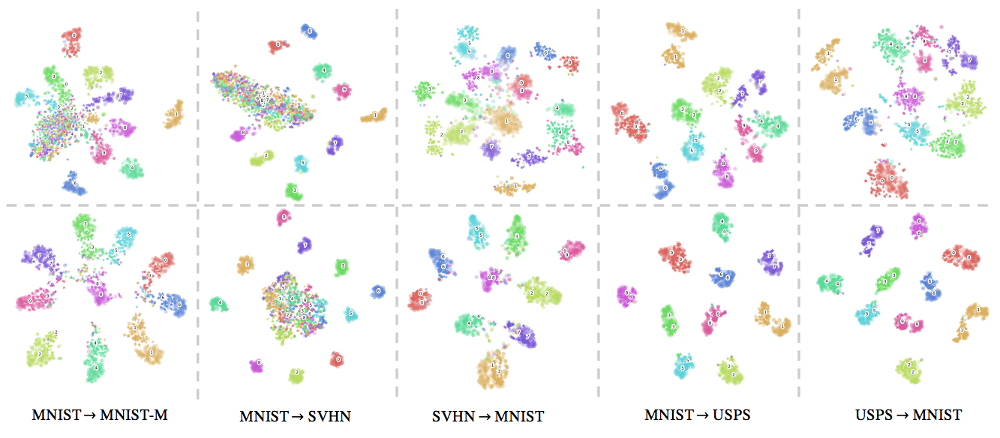

# Introduction

Gluon implementation for ```d-SNE: Domain Adaptation using Stochastic Neighbourhood Embedding```. This paper was presented at CVPR 2019 and can be found [here](https://arxiv.org/abs/1905.12775). d-SNE aims to perform domain adaptation by aligning the source domain and target domain in a class by class fashion. d-SNE is a supervised learning algorithm and requires a few labeled samples from the target domain for training. The semi-supervised extension can further improve its performance by incoporating unlabeled target data. 



# Dependencies

```bash
$ pip install -r requirements.txt

# Install the correct GPU version's mxnet
$ pip install mxnet-cu90 # for CUDA 9.0
```

# Datasets and abbreviations:
| Experiments | Datasets | Download|
| ----------- |:--------:| --------|
| Digits      | MNIST(MT), MNISTM(MM), SVHN(SN), and USPS(US)| ```sh scripts/download_digits_datasets.sh```|
| Office-31   | AMAZON (A), DSLR (D), and WEBCAM (W)         | ```sh scripts/download_office_datasets.sh```|
| VisDA       | Synthetic (S) and Real (R)                   | ```sh scripts/download_visda_datasets.sh```|

# Download the pre-trained model
```bash
$ sh scripts/download_pretrained_models.sh
```

# Experiments
## Download datasets
Due to licensing issues, we won't be able to host the datasets. The current patch will enable you to download and use the Office dataset from the original source. We are working on patching the other datasets.
```bash
$ sh scripts/download_digits_datasets.sh
$ sh scripts/download_office_datasets.sh
$ sh scripts/download_visda_datasets.sh
```

## Few Shot Supervised Domain Adaptation
### Digits Experiments: MT -> MM
For other experiments, just change the source and target abbr. names
- v0: Train on source domain and evaluate on the target domain
    ```bash
    $ python main_sda.py --method v0 --cfg cfg/digits-a.json --bb lenetplus --bs 256 --src MT --tgt MM --nc 10 --size 32 --train-src --log-itv 0 --dropout --hybridize
    ```
- v1: Train on source domain and random selected samples in the target domain
    ```bash
    $ python main_sda.py --method v1 --cfg cfg/digits-a.json --bb lenetplus --bs 256 --src MT --tgt MM --nc 10 --size 32 --train-src --log-itv 0 --dropout --hybridize
    ```
- v1: Fine-tune the model trained from the source selected samples in the target domain
    ```bash
    $ python main_sda.py --method v1 --cfg cfg/digits-a.json --bb lenetplus --bs 256 --src MT --tgt MM --nc 10 --size 32 --train-src --log-itv 0 --dropout --model-path path/to/model --hybridize
    ```
- ccsa \[1\]:
    ```bash
    $ python main_sda.py --method ccsa --cfg cfg/digits-a.json --bb lenetplus --bs 256 --src MT --tgt MM --nc 10 --size 32 --log-itv 0 --dropout --hybridize
    ```
- dsne: Train with dSNE
    ```bash
    $ python main_sda.py --method dsnet --cfg cfg/digits-a.json --bb lenetplus --bs 256 --src MT --tgt MM --nc 10 --size 32 --log-itv 100 --dropout --hybridize
    ```

- test:
    ```bash
    $ python main_sda.py --cfg cfg/digits-a.json --src US --tgt MT --method=dsnet --bb lenetplus --nc 10 --resize 32 --size 32 --dropout --postfix prefix/name --test --model-path model/path --plot
    ```

### Office Experiments: A -> D
#### Fine-tune the pre-trained model using the source domain

#### Adaptation with labeled target domain
- v0: Train on source domain and evaluate on the target domain
    ```bash
    $ python main_sda.py --method v0 --cfg cfg/offices.json --src A --tgt D --nc 31 --train-src --log-itv 0 --flip --random-color --random-crop --model-path path/to/model --fn --hybridize
    ```
- v1: Fine-tune with random selected samples in the target domain
    ```bash
    $ python main_sda.py --method v1 --cfg cfg/offices.json --src A --tgt D --nc 31 --log-itv 0 --flip --random-color --random-crop --model-path path/to/model --fn --hybridize
    ```
- dsnet: Train with dSNEt
    ```bash
    $ python main_sda.py --method dsnet --cfg cfg/offices.json --src A --tgt D --nc 31 --log-itv 100 --flip --random-color --random-crop --model-path path/to/model --fn --hybridize
    ```
### VisDA Experiments: S -> R
- v0: Train on source domain and evaluate on the target domain
    ```bash
    $ python main_sda.py --method v0 --cfg cfg/visa17.json --src S --tgt R --nc 12 --train-src --log-itv 0 --flip --random-color --random-crop --model-path path/to/model --fn --hybridize
    ```
- v1: Fine-tune with random selected samples in the target domain
    ```bash
    $ python main_sda.py --method v1 --cfg cfg/visa17.json --src S --tgt R --nc 12 --log-itv 0 --flip --random-color --random-crop --model-path path/to/model --fn --hybridize
    ```
- dsnet: Train with dSNEt
    ```bash
    $ python main_sda.py --method dsnet --cfg cfg/visa17.json --src S --tgt R --nc 12 --log-itv 100 --flip --random-color --random-crop --model-path path/to/model --fn --hybridize
    ```

# Reference
Please cite our CVPR 2019 Oral paper:
```
@InProceedings{Xu_2019_CVPR,
    author = {Xu, Xiang and Zhou, Xiong and Venkatesan, Ragav and Swaminathan, Gurumurthy and Majumder, Orchid},
    title = {d-SNE: Domain Adaptation Using Stochastic Neighborhood Embedding},
    booktitle = {The IEEE Conference on Computer Vision and Pattern Recognition},
    month = {June 16-20},
    year = {2019},
    pages = {2497-2506}
}
```

